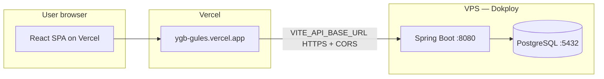

# YGB Backend Deployment on VPS (Dokploy)

This guide covers deploying the YGB Spring Boot backend and PostgreSQL database on a VPS using [Dokploy](https://dokploy.com), connecting it to the Vercel-hosted frontend, and accessing the database locally with Beekeeper Studio.

---

## Architecture



| Component | Host | Notes |
|-----------|------|--------|
| Frontend | Vercel | Static SPA; env `VITE_API_BASE_URL` baked in at build time |
| Backend API | VPS via Dokploy | Docker image from `backend/Dockerfile` |
| Database | VPS via Dokploy | PostgreSQL 16; not exposed publicly |
| CI/CD | GitHub Actions | `cd-backend.yml` triggers Dokploy webhook on `main` |

---

## Prerequisites

- A VPS (Ubuntu 22.04+ recommended) with at least **2 GB RAM** and **20 GB disk**
- A domain or subdomain for the API, e.g. `api.ygb.slogbaa.org`
- DNS **A record** pointing that subdomain to the VPS public IP
- Dokploy installed on the VPS ([official install docs](https://docs.dokploy.com/docs/core/installation))
- GitHub repository access (`ionatech2025/ygb`)
- Vercel project for the frontend (`ygb-gules.vercel.app`)

---

## Part 1 — PostgreSQL on Dokploy

You can run Postgres as a **Dokploy Database** service or as part of a **Docker Compose** stack. The managed database option is simpler for backups and connection strings.

### Option A — Dokploy managed PostgreSQL (recommended)

1. In Dokploy, open **Databases** → **Create Database**.
2. Choose **PostgreSQL** (version 16 if available).
3. Set credentials (save these securely):
   - Database name: `ygb_db`
   - User: `ygb_user`
   - Password: strong random password
4. Deploy the database and note the **internal hostname** Dokploy assigns (often something like `ygb-postgres` or a service name inside the Dokploy network).
5. **Do not** publish port `5432` to the public internet.

Connection URL format for the backend:

```text
jdbc:postgresql://<internal-host>:5432/ygb_db
```

### Option B — Docker Compose (repo `backend/docker-compose.yml`)

The repo ships a minimal compose file with only Postgres:

```yaml
services:
  db:
    image: postgres:16-alpine
    environment:
      POSTGRES_DB: ygb_db
      POSTGRES_USER: ygb_user
      POSTGRES_PASSWORD: <strong-password>
    volumes:
      - pgdata:/var/lib/postgresql/data
```

In Dokploy, create a **Compose** application, point it at the repo, set **Root Directory** to `backend`, and use this compose file. Bind Postgres to localhost only if you need SSH tunnel access:

```yaml
ports:
  - "127.0.0.1:5432:5432"
```

Flyway migrations run automatically when the backend starts (`spring.flyway.enabled=true`).

---

## Part 2 — Backend application on Dokploy

### Create the application

1. Dokploy → **Applications** → **Create Application**.
2. **Source:** GitHub → select `ygb` repository.
3. **Branch:** `main` (production).
4. **Build type:** Dockerfile.
5. **Root / context directory:** `backend`
6. **Dockerfile path:** `Dockerfile` (default inside `backend/`).
7. **Port:** `8080` (container exposes 8080).

### Domain and HTTPS

1. Open the application → **Domains**.
2. Add `api.ygb.slogbaa.org` (or your chosen API host).
3. Enable **Let's Encrypt** / automatic TLS via Dokploy's Traefik integration.
4. Confirm HTTPS works after deploy:

```bash
curl -s -o /dev/null -w "%{http_code}" https://api.ygb.slogbaa.org/api/v1/auth/login
```

A healthy backend returns **400**, **401**, or **405** (not `000` or `5xx`).

### Environment variables

Set these in Dokploy → Application → **Environment**:

| Variable | Example / value | Required |
|----------|-------------------|----------|
| `SPRING_PROFILES_ACTIVE` | `prod` | Yes |
| `SERVER_PORT` | `8080` | Yes |
| `SPRING_DATASOURCE_URL` | `jdbc:postgresql://<db-host>:5432/ygb_db` | Yes |
| `SPRING_DATASOURCE_USERNAME` | `ygb_user` | Yes |
| `SPRING_DATASOURCE_PASSWORD` | `<strong-password>` | Yes |
| `APP_JWT_SECRET` | Random string **≥ 32 characters** | Yes |
| `APP_JWT_EXPIRATION_MS` | `86400000` | Yes |
| `CORS_ALLOWED_ORIGINS` | See [CORS section](#cors_allowed_origins) | Yes |

Use Dokploy **secrets** for passwords and JWT secret where supported.

Reference template: [`backend/.env.example`](../backend/.env.example).

### Deploy

- Click **Deploy** in Dokploy, or push to `main` and let the GitHub webhook trigger a build (see Part 4).
- Check logs for:
  - Flyway migrations completing
  - `Started` Spring Boot message
  - No datasource connection errors

---

## CORS_ALLOWED_ORIGINS

The backend reads `CORS_ALLOWED_ORIGINS` as a **comma-separated** list (no trailing slashes on URLs). Spring uses **origin patterns**, so wildcards are supported for Vercel previews.

### Production value (copy into Dokploy)

```text
CORS_ALLOWED_ORIGINS=https://ygb-gules.vercel.app,https://*.vercel.app,https://www.ygb.slogbaa.org,http://localhost:5173
```

### What each origin is for

| Origin | Purpose |
|--------|---------|
| `https://ygb-gules.vercel.app` | Vercel **production** frontend |
| `https://*.vercel.app` | Vercel **preview** deployments (PR/branch URLs) |
| `https://www.ygb.slogbaa.org` | Custom production domain (when configured on Vercel) |
| `http://localhost:5173` | Local Vite dev server hitting the remote API (optional) |

### When you add more frontend domains

Append each HTTPS origin, comma-separated:

```text
...,https://ygb.slogbaa.org,https://dashboard.example.org
```

### What you must **not** do

- Do **not** use `*` in production if you later enable credentials/cookies.
- Do **not** omit the Vercel production URL — login and dashboard API calls will fail with browser CORS errors.
- Do **not** include trailing slashes (`https://ygb-gules.vercel.app/` is wrong).

### Verify CORS

From your machine:

```bash
curl -i -X OPTIONS "https://api.ygb.slogbaa.org/api/v1/public/dashboard/summary" \
  -H "Origin: https://ygb-gules.vercel.app" \
  -H "Access-Control-Request-Method: GET"
```

Expect `Access-Control-Allow-Origin: https://ygb-gules.vercel.app` (or matching pattern) in the response headers.

---

## Part 3 — Link the Vercel frontend

The frontend does **not** proxy API requests in production. It calls the backend directly using `VITE_API_BASE_URL`.

### Vercel environment variables

In **Vercel → Project → Settings → Environment Variables**:

| Name | Value | Environments |
|------|-------|--------------|
| `VITE_API_BASE_URL` | `https://api.ygb.slogbaa.org` | Production, Preview, Development |

Rules:

- **No trailing slash**
- Must be **HTTPS** in production
- Changing this requires a **new deploy** (Vite inlines env at build time)

### Redeploy frontend

After setting the variable:

1. Vercel → **Deployments** → **Redeploy** latest (or push a commit).
2. Open `https://ygb-gules.vercel.app/dashboard` — data should load instead of a blank page.

### End-to-end checklist

- [ ] Backend health URL responds (not connection refused)
- [ ] `CORS_ALLOWED_ORIGINS` includes Vercel production + `https://*.vercel.app`
- [ ] `VITE_API_BASE_URL` on Vercel matches backend public URL
- [ ] Browser DevTools → Network: `/api/v1/public/dashboard/*` returns **JSON**, not HTML
- [ ] No CORS errors in the browser console

---

## Part 4 — GitHub Actions CD (optional automation)

The repo includes [`.github/workflows/cd-backend.yml`](../.github/workflows/cd-backend.yml). On successful Backend CI on `main`, it:

1. POSTs to `DOKPLOY_PRODUCTION_WEBHOOK_URL`
2. Waits 60 seconds
3. Hits `BACKEND_PRODUCTION_URL/api/v1/auth/login` for a health check

### GitHub repository settings

**Secrets** (or **Variables**):

| Name | Description |
|------|-------------|
| `DOKPLOY_PRODUCTION_WEBHOOK_URL` | Dokploy deploy webhook URL for the backend app |
| `BACKEND_PRODUCTION_URL` | `https://api.ygb.slogbaa.org` (no trailing slash) |

In Dokploy, copy the webhook from the application **Deployments** / **Webhook** section.

---

## Part 5 — Access PostgreSQL with Beekeeper Studio

Never expose PostgreSQL on `0.0.0.0:5432` without a firewall. Use an **SSH tunnel** from your laptop through the VPS.

### Step 1 — Ensure Postgres is reachable on the VPS loopback

If Postgres runs in Docker, publish only to localhost on the VPS:

```yaml
ports:
  - "127.0.0.1:5432:5432"
```

If using Dokploy's internal network only, SSH into the VPS and use `docker ps` to find the Postgres container, then tunnel to its published localhost port.

### Step 2 — Open an SSH tunnel (Windows PowerShell or terminal)

```bash
ssh -N -L 5433:127.0.0.1:5432 deploy-user@YOUR_VPS_IP
```

Leave this session open. Local port `5433` forwards to Postgres on the VPS.

Use a different local port if `5433` is already in use.

### Step 3 — Beekeeper Studio connection

Create a **PostgreSQL** connection:

| Field | Value |
|-------|--------|
| Host | `127.0.0.1` |
| Port | `5433` (local tunnel port) |
| User | `ygb_user` |
| Password | your DB password |
| Database | `ygb_db` |
| SSL | Off (traffic is inside SSH tunnel) |

Click **Test** → **Connect**.

### Useful queries

```sql
-- Flyway migration history
SELECT * FROM flyway_schema_history ORDER BY installed_rank;

-- Submission counts
SELECT COUNT(*) FROM submissions;

-- Admin users
SELECT id, phone_number, role, active FROM users;
```

### Alternative — SSH tunnel inside Beekeeper

Beekeeper supports **Use SSH Tunnel** in the connection settings:

1. Enable **Use SSH Tunnel**
2. SSH host: VPS IP, user, key
3. Database host: `127.0.0.1`, port `5432` (on the VPS side)

Same security model, integrated into the GUI.

---

## Part 6 — Operations

### Logs

- **Dokploy:** Application → **Logs** (build + runtime)
- **Spring Boot:** stack traces on failed migrations or auth errors

### Backups

- Schedule Postgres dumps from the VPS (cron + `pg_dump`) or use Dokploy backup features if enabled
- Store backups off-server (S3, another machine)

### Updating the backend

1. Merge to `main` → CI runs tests → CD webhook redeploys Dokploy
2. Or manual **Redeploy** in Dokploy after pulling latest image/build

### JWT secret rotation

Changing `APP_JWT_SECRET` invalidates all existing admin/collector sessions. Plan a maintenance window.

---

## Troubleshooting

### Dashboard flashes then goes blank (Vercel)

**Cause:** `VITE_API_BASE_URL` unset → browser calls Vercel `/api/*` → HTML instead of JSON.

**Fix:** Set `VITE_API_BASE_URL` on Vercel to the Dokploy API URL and redeploy. See [`frontend/.env.example`](../frontend/.env.example).

### Browser console: CORS policy blocked

**Cause:** Frontend origin not listed in `CORS_ALLOWED_ORIGINS`.

**Fix:** Add the exact origin (or `https://*.vercel.app` for previews) on the backend and redeploy.

### Backend won't start — Flyway / database

**Symptoms:** `Validate failed`, `Connection refused`, `password authentication failed`

**Fix:**

- Verify `SPRING_DATASOURCE_URL` host matches Dokploy internal DB hostname
- Confirm DB is running and credentials match
- Check Dokploy network: backend and DB must share a network

### CD health check fails

**Fix:**

- Confirm `BACKEND_PRODUCTION_URL` is correct and TLS certificate is valid
- Increase wait time in `cd-backend.yml` if the VPS is slow to build
- Check Dokploy build logs for Maven/Docker failures

### Beekeeper cannot connect

**Fix:**

- Ensure SSH tunnel is running
- Confirm Postgres binds to `127.0.0.1:5432` on the VPS
- Test from VPS: `psql -h 127.0.0.1 -U ygb_user -d ygb_db`

---

## Quick reference — full production wiring

```text
# Dokploy backend env
SPRING_PROFILES_ACTIVE=prod
SPRING_DATASOURCE_URL=jdbc:postgresql://<db-host>:5432/ygb_db
SPRING_DATASOURCE_USERNAME=ygb_user
SPRING_DATASOURCE_PASSWORD=<secret>
APP_JWT_SECRET=<32+ char secret>
CORS_ALLOWED_ORIGINS=https://ygb-gules.vercel.app,https://*.vercel.app,https://www.ygb.slogbaa.org,http://localhost:5173

# Vercel frontend env
VITE_API_BASE_URL=https://api.ygb.slogbaa.org

# GitHub CD
DOKPLOY_PRODUCTION_WEBHOOK_URL=<dokploy webhook>
BACKEND_PRODUCTION_URL=https://api.ygb.slogbaa.org
```

---

## Related files

| File | Purpose |
|------|---------|
| [`backend/Dockerfile`](../backend/Dockerfile) | Multi-stage Java 21 build |
| [`backend/docker-compose.yml`](../backend/docker-compose.yml) | Local / compose Postgres |
| [`backend/.env.example`](../backend/.env.example) | All backend env vars + CORS |
| [`frontend/.env.example`](../frontend/.env.example) | `VITE_API_BASE_URL` |
| [`frontend/vercel.json`](../frontend/vercel.json) | SPA routing; `/api` excluded from rewrite |
| [`.github/workflows/cd-backend.yml`](../.github/workflows/cd-backend.yml) | Dokploy webhook deploy |
